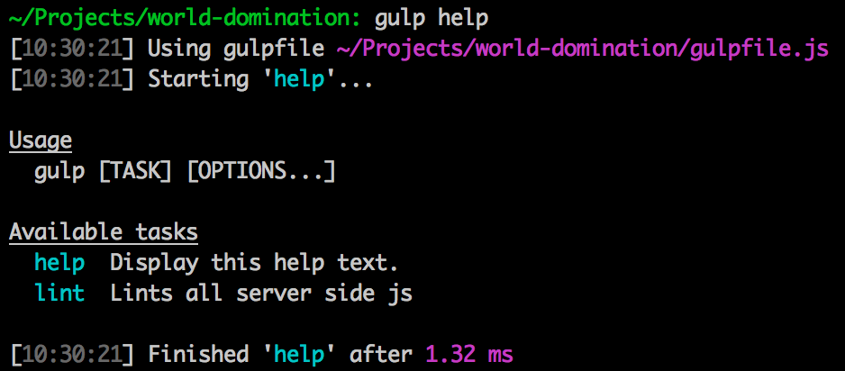

# [gulp](https://github.com/gulpjs/gulp)-help [![Build Status][travis-image]][travis-url]
> Adds a default help task to gulp and provides the ability to add custom help messages to your gulp tasks

NOTE: this version only works with [gulp 4](https://github.com/gulpjs/gulp/tree/4.0). For `gulp-help` that works with
prior versions of gulp, use npm `v1.6.1`.

## Install

```bash
$ npm install --save-dev chmontgomery/gulp-help#gulp4
```

## Usage

Before defining any tasks, add `gulp help` to your gulp instance

```js
// gulpfile.js
var gulp = require('gulp-help')(require('gulp'));
```

Next, define help text for each custom task

```js
// gulpfile.js
function clean(done) {
  //...
  done();
}
clean.description = 'clean all the files';

function coffee(done) {
  //...
  done();
}
coffee.description = 'Compile coffeescript';

var build = gulp.series(clean, coffee);
build.description = 'this builds all the things';

gulp.task('build', build);

gulp.task('clean', clean);

gulp.task(coffee);
```

Now show that help via `gulp help`



## `gulpHelp(gulpInstance[, options])`

`gulp-help` is completely customizable. [See here for overridable options](index.js#L4).

## License

MIT © [Chris Montgomery](http://www.chrismontgomery.info/)

[npm-url]: https://npmjs.org/package/gulp-help
[npm-image]: http://img.shields.io/npm/v/gulp-help.svg
[travis-image]: https://travis-ci.org/chmontgomery/gulp-help.svg?branch=gulp4
[travis-url]: https://travis-ci.org/chmontgomery/gulp-help
