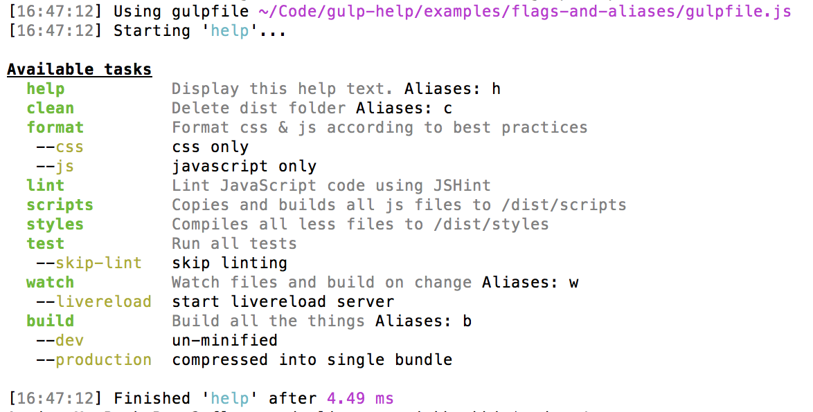

# Themes

To use a different theme, simply require it

```js
// gulpfile.js
var gulp = require('gulp-help')(require('gulp'), require('gulp/themes/lemonade'));
```

Check out the [themes folder](../themes) for all available, pre-built themes.

## Default
  

## Lemonade
  

You can easily create your own custom theme. [See here for overridable options](../index.js#L4).
We are also accepting PRs if you would like to share your custom theme with others.
